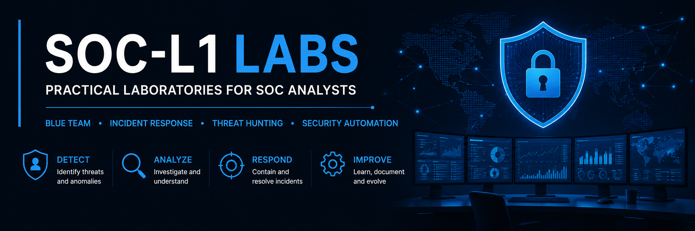

<p align="center">
  
</p>

# 🛡️ SOC-L1 Labs

> **Practical laboratories focused on the day-to-day work of a Security Operations Center (SOC) Analyst.**

Welcome to **SOC-L1 Labs**, a collection of practical cybersecurity laboratories designed to develop and demonstrate the technical skills required for a **Junior SOC Analyst**.

The purpose of this repository is to document realistic scenarios involving **network traffic analysis, incident response, threat detection, log analysis and security automation**, following a structured and professional methodology.

---

# 🎯 Objectives

This repository has been created to:

- Develop practical Blue Team skills.
- Document cybersecurity investigations in a professional manner.
- Improve analytical and troubleshooting capabilities.
- Practice incident response workflows.
- Build a portfolio aligned with SOC L1 positions.

---

# 🧰 Areas Covered

## 🌐 Network Traffic Analysis

- Wireshark
- TCP/IP
- DNS
- HTTP / HTTPS
- ICMP
- ARP
- Packet inspection

---

## 📑 Log Analysis

- Windows Event Logs
- Linux Logs
- Apache Logs
- Authentication Logs

---

## 🚨 Incident Response

- Detection
- Triage
- Containment
- Investigation
- Recovery
- Lessons Learned

---

## 🔍 Threat Hunting

- Indicators of Compromise (IOCs)
- MITRE ATT&CK
- Sigma Rules
- YARA

---

## ⚙️ Security Automation

- Python
- Bash
- IOC processing
- Log parsing
- Simple automation scripts

---

# 📂 Repository Structure

```text
SOC-L1-Labs
│
├── README.md
├── assets/
│
├── 01-Network-Traffic-Analysis
├── 02-Log-Analysis
├── 03-Incident-Response
├── 04-Threat-Hunting
├── 05-Security-Automation
│
└── templates/
```

---

# 📚 Laboratory Methodology

Every laboratory follows the same structure:

1. Objective
2. Scenario
3. Environment
4. Tools Used
5. Investigation Process
6. Findings
7. Conclusions
8. Lessons Learned

This methodology reflects the workflow commonly followed by SOC analysts during incident investigations.

---

# 🚧 Current Status

This repository is currently under active development.

New laboratories, reports and automation scripts will be added progressively as part of my continuous learning journey.

---

# 🎯 Roadmap

## Network Analysis

- [ ] HTTP Traffic Analysis
- [ ] DNS Investigation
- [ ] Detecting Port Scans
- [ ] Suspicious Connections
- [ ] ARP Spoofing Detection

## Log Analysis

- [ ] Windows Event Logs
- [ ] Linux Authentication Logs
- [ ] Apache Access Logs

## Incident Response

- [ ] Brute Force Investigation
- [ ] Phishing Analysis
- [ ] Malware Investigation

## Automation

- [ ] IOC Extractor
- [ ] Log Parser
- [ ] Hash Checker
- [ ] Port Scanner
- [ ] Password Generator

---

# 👨‍💻 Author

**Jesús Díaz**

Junior Cybersecurity Analyst

- 💼 LinkedIn: https://www.linkedin.com/in/jesus-diaz-exposito
- 🌐 Portfolio: https://jediex69.github.io
- 🐙 GitHub: https://github.com/Jediex69

---

> *"Learning cybersecurity means understanding how incidents happen, documenting them properly and continuously improving the ability to detect and respond to them."*
